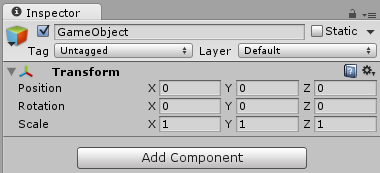
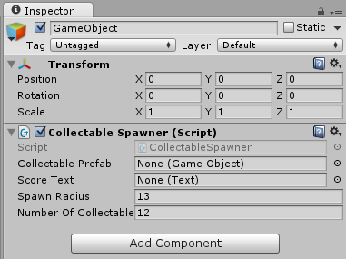
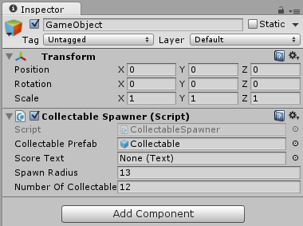
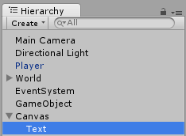
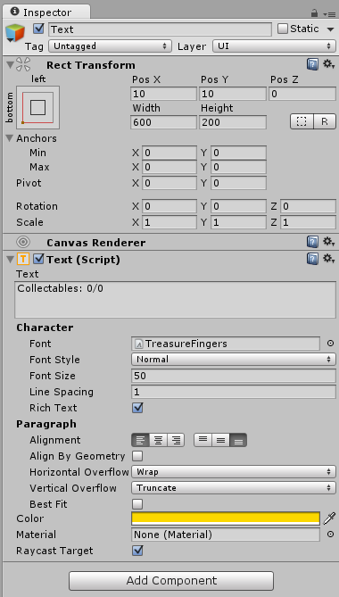
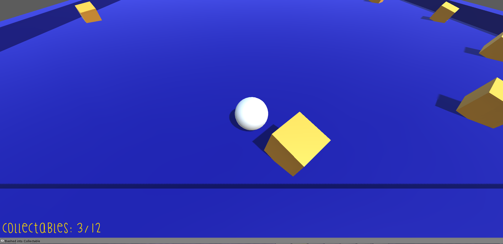

[TOC]

# Roll-A-Ball tutorial 1.1 #
This project is a tutorial based on Unity3D's [Roll-A-Ball](https://unity3d.com/learn/tutorials/projects/roll-ball-tutorial) tutorial.

## What is this tutorial for? ##
This tutorial acts as an introduction to the Unity work-flow. In this tutorial, you will learn how to use GameObjects, Prefabs, components (e.g. MonoBehaviours) and Scenes.

## Who do I talk to? ##
* If you have any questions, please contact the owner of this project (Ryan Mazzolini).

## How do I get set up? ##
* Clone the project from [https://bitbucket.org/creative630/rollaball](https://bitbucket.org/creative630/rollaball)
* Open the project in Unity, you can do this by browsing to the project through Unity, or by double clicking on a scene in the project's Assets folder.
* If not open already, open the "RollABall" scene in the Scenes folder under the project view.

### Play the game! ###
Press the play button.

You can move around in the game by using the WSAD, or arrow keys.
You might notice that you can't do very much in the game at the moment.

### Lets fix this! ###

First, create a new empty game object and make sure that all of its transform values are 0. This places the transform at the worlds origin point.

Next add a MonoBehaviour script called "Collectable Spawner" to the GameObject. This is already created for you, and is found in the "Scripts" folder. You can add the new component by clicking on the "Add Component" button below the transform. Your GameObject should now look like this:

If you run the game at this point you should receive an "UnassignedReferenceException" error message in the console. You can find the console under the Window menu, or by clicking on the red message at the bottom of the Unity Editor. To fix this, add the prefab called "Collectable" from the project menu to the empty component variable called "Collectable Prefab". It should now look like this:

Run the game! You should now be able to bash into collectables, which breaks apart and plays an audio clip.

Do you notice the red text saying "ScoreText is null" when you bashed into a collectable?? Well that's no good...
I think one of the components is trying to tell you something...

### Lets add text UI! ###
Click on the GameObject, then UI, then Text menu items. This will create a Canvas with a text object called Text. It should like something like this in the project hierarchy.

Getting the hang of setting up game objects yet? Well select the Text object and make it look like this:

If you look at the game view you should see the text in the bottom left hand corner! If not double check all the component variables on the Text object.

The error message is still there you say? Well lets get rid of it. Drag the Text object from the hierarchy onto the "Collectable Spawner" and Player's "Player controller" script. The text should be working now! Yay! A complete game!

## Now the scripts... ##